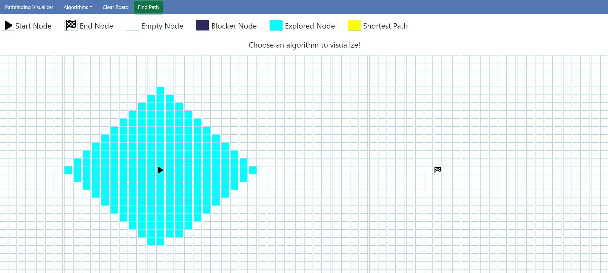
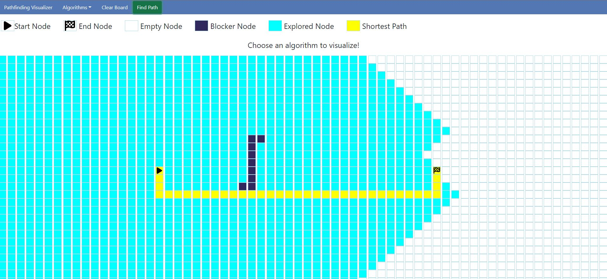
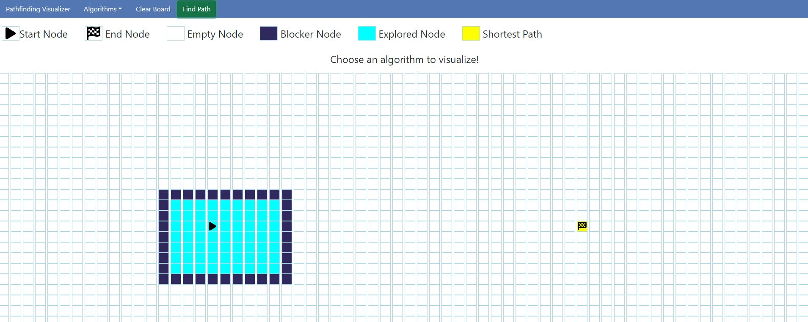

# Pathfinding Visualizer
[Link to the deployed application]()

## Table of Contents
- [Pathfinding Visualizer](#pathfinding-visualizer)
  - [Table of Contents](#table-of-contents)
  - [Overview](#overview)
  - [Technologies](#technologies)
  - [Preview](#preview)
  - [Contact Me](#contact-me)

## Overview

A visualizer for pathfinding algorithms, making it easier to understand how the underlying algorithm works.

## Technologies

- HTML
- CSS
- JavaScript
- React

## Preview

## Contact Me

Contact me if you have any questions or want to connect.
- Github: [@EzequielMejiasMelo](https://github.com/EzequielMejiasMelo)
- LinkedIn: [ezequiel-mejias-melo](https://www.linkedin.com/in/ezequiel-mejias-melo/)
- Email: [ezequiel.mejiasmelo@gmail.com](ezequiel.mejiasmelo@gmail.com)
